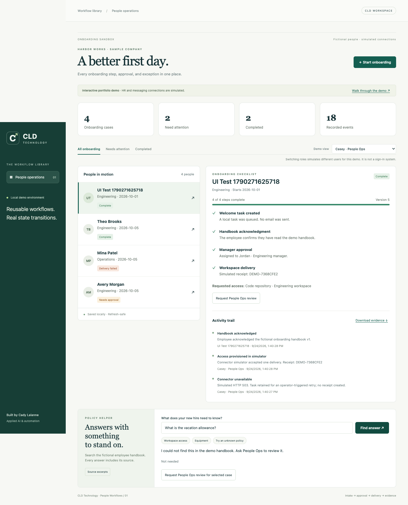

# People Workflows

A runnable local portfolio demo by **Cady Lalanne / CLD Technology**: onboarding, assigned-manager approval, a deliberately failed delivery, retry, employee acknowledgement, and an audit trail.

Everything in this package is fictional. No account, API key, HR system, signup form, or cloud service is required. No email is sent and no access is provisioned.

## Start

Python 3.10+ and a modern browser. From this directory:

```sh
python3 server.py --port 8778
```

Open **http://127.0.0.1:8778**. Stop with Ctrl+C. If occupied, choose another port. The server binds only to loopback. Local records persist in `.data/demo.sqlite3`, which is excluded from Git. For a fresh walkthrough:

```sh
python3 server.py --port 8779 --db .data/fresh-walkthrough.sqlite3
```

## Five-minute walkthrough

1. Select Avery, or create a fictional Engineering hire as Casey (People Ops).
2. Switch Demo view to Jordan, the assigned Engineering manager, and approve access.
3. Switch to Casey; process delivery. Observe the intentional connector failure and retry it.
4. Switch to that employee and acknowledge the handbook. The case becomes Complete.
5. Download the evidence, refresh, and confirm the state persists.
6. Ask who approves workspace access; inspect the cited handbook excerpt. Ask about an unknown vacation policy and see the handoff.

## Verify

```sh
python3 -m unittest discover -s tests -v
node --check static/app.js
```

Python tests cover the HTTP journey, duplicate/concurrent commands, actor boundaries, stale versions, failure/retry, persistence, audit protection, malformed requests, cross-origin requests, and invalid model citations. Node is needed only for the optional JavaScript syntax check. CI runs the Python suite on 3.10 and 3.13.

## Design

Browser → loopback HTTP API → deterministic workflow rules → SQLite. The policy helper is read-only and cannot perform workflow actions. See [architecture](docs/architecture.md) and [security boundaries](SECURITY.md).

Keyword retrieval returns exact source excerpts by default. Optional `PEOPLE_OLLAMA_MODEL` enables an already-installed local Ollama model on localhost:11434 to select validated citation IDs. Failure falls back to source excerpts. Optional model behavior has mock tests; live model quality is not established.

## Honest scope

This demonstrates workflow engineering, not production HR software. The role selector is **not authentication**; anyone with local access can choose a fictional actor. Do not enter employee/customer information, expose this development server publicly, or treat it as a security boundary between real users.

Declined cases stay blocked for review; edit-and-resubmit is not implemented. Receipts guarantee one local simulated delivery only. Production integrations would need authenticated identity, a durable outbox, reconciliation, tenancy, retention controls, and operational monitoring. No production ROI or performance claims are made.

## Verification evidence

[Verification notes](docs/verification.md) · [Test output](docs/test-results.txt)


